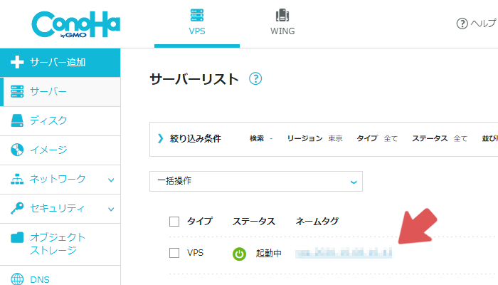
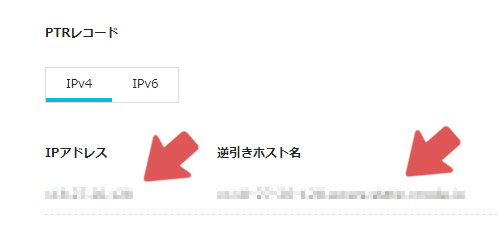
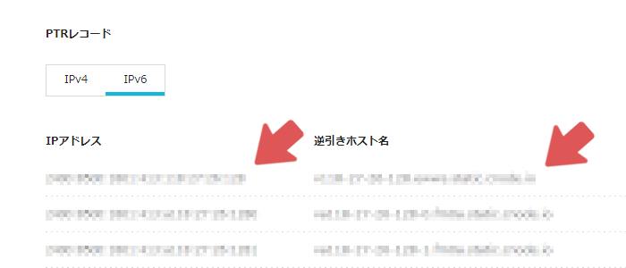
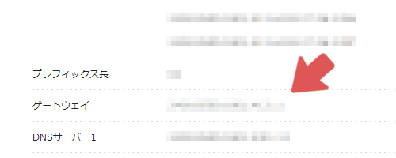
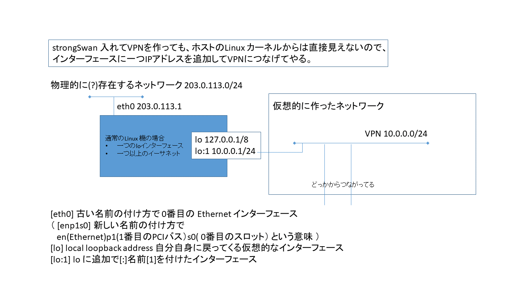

# 映像配信サーバーの構築手順

## 忠告
この解説では、全ての操作をLinuxのCUI上で行います。
テキストファイルの編集や、プログラムのインストールなども全てCUI上で行います。
そのため、Linuxの基本的なコマンドをある程度把握していないと、作業が厳しくなります。
映像配信サーバーの構築を行う前に、Linux上でテキストファイルの編集ができる程度に勉強しておくと、作業がスムーズに進むと思います。
  
勉強方法ですが、Googleで「Linux とは」や「Linux 基本 コマンド」などと調べると、解説記事が大量に見つかります。
見つかったサイトであらかじめ予備知識を蓄えておくことをおすすめします。
テキスト編集を行うソフトは何でもよいですが、最初は`nano`がおすすめです。他には`vim`や`emacs`などがあります。
この解説では`vim`を用いてテキストを編集しますが、それぞれ好きなエディタに置き換えてテキストを編集してください。

## 概要
映像を配信するためのサーバーを構築する手順を解説します。
構築手順を説明する前に、使用するOSとプログラムを説明します。

### OS
サーバーのOSには`Ubuntu 18.04 (64bit)`を用います。
UbuntuはLinuxディストリビューションの1つです。
また、ここではOSを動かすためにConoha VPSでサーバーをレンタルしました。
VPSのプランは`CPU 1Core`　`SSD 30GB`を使用しました。
  
補足ですが、Conoha VPSはレンタル料金が1時間単位で計算されるので、ちょっとしたLinux環境の用意に適しています。
また、OSのインストールも1分ほどで終了するので、仮に実行環境を汚してしまっても、すぐにOSを再インストールし、気軽にやり直すことができます。

### 映像配信サーバー
映像配信サーバーには`nginx-rtmp-module`を用います。
これはrtmp形式の配信サーバーを`nginx`のプラグインという形で起動させることができるプログラムです。
`nginx`とは、webサーバーの1つです。

### 通信の暗号化及びVPN (Virtual Private Network)
今回の映像配信システムの使用するプロトコルであるrmtpは通信を暗号化しません。これではネットワークの通信経路に傍受者がいた場合に脆弱です。
具体的には映像の流出がおきます。これでは不味いので、暗号化する手段を考えます。
  
暗号化する仕組みにはいくつかの選択肢がありますが、今回はIP標準のネットワーク暗号化システムであるIPsecトンネルでVPNを構築します。
IPsecはレイヤー3で動作し (IPv4及びIPv6の) IPパケットをカプセル化して暗号化を行います。
これによりレイヤー4のTCP/UDP、及びそれ以上のレイヤー (http、https、そして今回使用するrmtp等) のプロトコルを透過的に暗号化します。
(透過的に暗号化: 上位プロトコルから見て暗号化機能が無いかのように振る舞い、上位プロトコルを一切を変更すること無く暗号化機能を提供することを言います)
また、メンテナンス用にsshログインを行うために IPsecトンネルを用意した方が良いと判断しました。
  
以下便宜的にIPsecトンネルを用いた暗号化系のことをVPNと呼びます。
(IPsecにはホスト間の通信をまとめて暗号化するトンネルモードと特定の通信を指定して暗号化するトランスポートモードの二種類がありますが、一般的にVPNと呼ばれるあるいはVPNと言われて想像するのはIPsecではトンネルモードの方です。)
  
今回のVPNの構築のために、`strongSwan`を使用します。
  
現代の多くのOSはカーネルにIPsecの機能を持ちますしLinuxもまたカーネルにIPsecの機能を持ちそれ自体が暗号化機能を提供していますが、
実際に暗号通信を行うためには、相互に認証し暗号化を行うための鍵を交換するための機能 (Ineternet Key Exchange IKEと呼ばれます) を別途用意する必要があります。
`strongSwan`には、`IKE daemon`である`charon`及びcharonの制御ツールである`swanctl`が含まれます。
Windowsの場合も同様にIKEを担当する`IKE and AuthIP IPsec Keying Modules`そしてそれのコントロール用である`リモートアクセス`に分かれています。
  
そしてこのVPN上にrtmpを流すことにより、セキュリティを担保します。
  
(なおIPsec には、サーバ・クライアントの概念はありませんが、以下便宜上 strongSwan の事を VPNサーバと呼ぶことにします。)

### Domain Name System (DNS) and Dyanmic update
DNSサーバーには`bind9`を用います。
このサーバーも無くても動作はしますが、作業効率を上げるために立てておきます。
VPNサーバーに接続したコンピューターにはそれぞれ、`10.0.0.103`のようなローカルIPアドレスが割り振られます。
しかし、そのIPアドレスは (多分) 接続するたびに変動します。
これは不便であるため、コンピューターごとに固定のアドレスを指定したかったのですが、設定項目を見つけるとこができませんでした。
そこで、代替案としてDDNSサーバーを構築することにしました。
今回は、VPNに接続・切断がされるとDynamic Updateの仕組みを利用して、DNSにホスト名を登録・削除を行うスクリプトを作成しました。
この仕組みによって、VPNサーバーに接続するコンピュータごとに固定のドメイン名を割り振ることができます。
たとえば`10.0.0.103`のアドレスの代わりに、`computer001.example`といったドメイン名でアクセスできるようになります。

### WEBサーバー
WEBサーバーには`nginx`と`nodejs`の2つを用います。
`nginx`は映像配信サーバーである`nginx-rtmp-module`を動作させるために必要です。
また、ブラウザから配信の録画ファイルをダウンロードできるようにするためにも使用します。
`nodejs`はWEBサーバーではなく、`javascript`の実行環境です。
`javascript`を用いてWEBサーバーを構築し、映像配信の一覧をブラウザから確認できるようにするために使用します。

## ステップ0 環境構築
(あとで書く)
(ユーザーの追加、最低限のパッケージのインストール、鍵の生成、ssh接続の設定、など)

## ステップ1 必要な情報の取得
ここでは、今後の作業で必要になる情報をあらかじめ整理しておきます。
取得した情報はどこかにメモしておくと良いと思います。
また、解説にはコマンドや設定ファイルのテキストなどが度々登場します。
それらの中には、自分で書き換えるべき箇所もありますので、コピーをした後に適宜書き換えてください。
書き換えるべき箇所は全て三角カッコ (`<`と`>`) で説明が書かれています。
例えば、`<サーバーのIPv4アドレス>`と書かれている場合は`123.45.67.89`のように変更してください。
`ABCD <サーバーのIPv4アドレス> EFGH`と書かれている場合は`ABCD 123.45.67.89 EFGH`のように変更してください。

### サーバーのドメイン名やIPアドレスなどの取得
ここでは次の4つの情報を取得します。

- サーバーのIPv4アドレス
- サーバーのIPv6アドレス
- サーバーのドメイン名
- IPv6のゲートウェイ

まずブラウザからConoha VPSの管理画面にログインします。
左側にある`サーバー`を開いて、サーバーリストから今回使用しているサーバーのネームタグをクリックします。
  

  
次に、`VPS設定`の項目内に`PTRレコード`の項目があるので、`IPv4`を選択します。
さらにその下に、`IPアドレス`と`逆引きホスト名`の項目があります。
  

  
ここに記載されている文字列をそれぞれ`サーバーのIPv4アドレス`と`サーバーのドメイン名`としてメモしておきます。
次に、`PTRレコード`を`IPv6`に切り替え、もう一度`逆引きホスト名`の項目を見ます。
  

  
この中に、先ほど取得した`サーバーのドメイン名`と同一のホスト名があります (恐らく1番上にあります) 。
そのホスト名に対応しているIPアドレスを`サーバーのIPv6アドレス`としてメモしておきます。
次に、`ネットワーク情報`の項目内にある`タイプ`を`IPv6`に変更します。
さらに下のほうに`ゲートウェイ`という項目があります。



このアドレスを`IPv6のゲートウェイ`としてメモしておきます。

## ステップ2 証明書の発行
証明書とは、自分が偽物ではないことを証明するためのデータで、相手側に送信し相手側がその証明書の正当性を検証することにより正当性が保障されます。
この証明書は認証局から発行されます。有名な認証局には、政府認証基盤のブリッジ認証局やマイナンバーカードの署名を取り扱う署名用認証局、民間のVerisign, Inc (ベリサイン) そして、証明書の普及を目的として無料で発行を行う`Let's Encrypt`等があります。
詳しい仕組みについては、IPAの[「デジタル署名」](https://www.ipa.go.jp/security/pki/024.html)や[「認証局および周辺要素」](https://www.ipa.go.jp/security/pki/032.html)の解説が参考になります。
この証明書はIKEの鍵交換の際に自己の証明のために使われます。他の方法としてはパスワードによる認証等がありますが、いくつかのOSのクライアントはサーバ側の認証に証明書が必須になっているために今回は証明書を使います。
  
また、認証局は自分で立てることも可能ですが、その場合は認証局自身を証明するファイル (ルート証明書) をVPNクライアント全てにダウンロードしてもらう必要があり、VPNを使う側にとっては面倒です。
そのため、今回は証明書を無料で発行してもらえる`Let's Encrypt`を使用します。
ただし、`Let's Encrypt`ではドメイン名が必要になります。
Conoha VPSではドメイン名がサーバーごとに付与されますが、それ以外の環境では別途ドメインを購入する必要があるかもしれません。
  
[Let's Encryptの公式サイト](https://letsencrypt.org/)
  
2020年時点では、`Let's Encrypt`から発行される証明書の有効期限は3ヶ月です。
証明書を手動で更新するのは面倒であるため、今回は`certbot`を使用して更新を自動化します。
まず、[certbotの公式サイト](https://certbot.eff.org/lets-encrypt/ubuntubionic-other)を参考に、必要なパッケージをインストールします。

```bash
sudo snap install core; sudo snap refresh core
sudo snap install --classic certbot
sudo ln -s /snap/bin/certbot /usr/bin/certbot
```

次に、証明書を発行します。

```bash
sudo certbot certonly --standalone
```

実行をすると`メールアドレス`と`同意するかどうか`と`サーバーのドメイン名`を聞かれるので、それぞれ入力していきます。
`メールアドレス`は適当に自分のメールアドレスを入力します。
`同意するかどうか`では`y`と入力します。
`サーバーのドメイン名`はステップ1で取得したものを使用します。
成功すると、`/etc/letsencrypt/live/<サーバーのドメイン名>/`に4つのpemファイルが生成されます。
`privkey.pem`は証明書の発行に使用された秘密鍵です。
`chain.pem`は認証局の証明書 (中間証明書) です。
`cert.pem`は自分のサーバーの証明書 (エンドエンティティ証明書) です。
`fullchain.pem`は`chain.pem`と`cert.pem`を1つにまとめたものです。

## ステップ2 VPNサーバーの構築
まず、必要なパッケージをインストールします。

```bash
sudo apt install charon-systemd libcharon-extra-plugins
```

次に、VPNに接続できるようにするために設定ファイルを編集します。

```bash
sudo vim /etc/swanctl/conf.d/responder.conf
```

設定ファイルは以下のようになります。

```/etc/swanctl/conf.d/responder.conf
authorities {
	lets-encrypt {
		# 中間証明書の絶対パス
		file = /etc/letsencrypt/live/<サーバーのドメイン名>/chain.pem
	}
}

connections {
	user {
		# IKEv2を使用
		version = 2

		# MOBile IKE と言って、携帯電話に代表されるIPアドレスが変更されるような環境で、IPアドレスが変更されてもIPsecの接続は継続されるようにされる機能です。
		mobike = yes

		# 通常IKEの認証ではまず、レスポンダに証明書の要求を送ってからレスポンダはそれに応答する形で証明書を送信してきます。
		# ただしmacOSでは、必ずレスポンダが証明書を送ってくるものとして待機します。
		# このために、macOSから接続を行うと、レスポンダが証明書を送ってこないので認証失敗する事になります。
		# この設定は、イニシエータからレスポンダに証明書が送られてこなくても、証明書を送信するという設定です。
		send_cert = always

		# IPsecで使用する暗号化方法を指定します。基本はdefaultで良いのですが、MS-Windowsはmodp1024以下しか受け取りません。
		# modp1024は2020年現在既に時代遅れでdefaultから外されていますが、Windowsからつながらないのは問題なので、追加してあります。
		proposals = aes256-sha384-ecp256-ecp521-modp1024,default

		rekey_time = 0s

		# クライアントに割り振るプライベートIPの範囲の設定 (poolセクション内に記述した自分で決めたセクション名を書く)
		pools = user_ip

		fragmentation = yes

		dpd_delay = 30s

		# 自身のサーバーのIPv4アドレスとIPv6アドレス
		local_addrs = <サーバーのIPv4アドレス>,<サーバーのIPv6アドレス>

		local-1 {
			# 自身のサーバーの証明書の絶対パス (相対パスの場合は/etc/swanctl/x509/の内部が参照される)
			certs = /etc/letsencrypt/live/<サーバーのドメイン名>/fullchain.pem

			# 自身のサーバーのドメイン名
			id = <サーバーのドメイン名>

		}

		remote-1 {
			# クライアントからサーバーへアクセスするときの認証方式
			auth = eap-mschapv2

			# クライアントのidはなんでも受け付ける (%anyは「なんでもOK」という特殊な値)
			eap_id = %any

		}

		children {
			user {
				# VPNクライアントは以下の範囲の通信のみをVPNを通して通信する
				local_ts = 10.0.0.0/24

				rekey_time = 0s

				dpd_action = clear

				# yamahaのルーターに対応するためらしい?
				esp_proposals = aes256-sha384,default

				# クライアントの接続と切断時に、指定したスクリプトを実行するようにする
				updown = /etc/swanctl/script/updown.sh iptables

			}
		}
	}
}

pools {
	user_ip {
		# VPNクライアントに割り振るプライベートIPの範囲
		addrs = 10.0.0.100-10.0.0.200

		# DNSサーバーのIPアドレス
		dns = 10.0.0.1

	}
}

secrets {
	private-second {
		file = privkey.pem
	}

	# 以下はVPN接続の認証に用いるユーザー一覧です。
	# 必要に応じて増やしたり減らしたりしてください。

	# 1人目のユーザー
	eap-guest001 {
		# VPN接続の認証に用いるユーザー名
		id-guest001 = guest001

		# VPN接続の認証に用いるパスワード
		secret = <32文字ぐらいの長めのパスワード>
	}

	# 2人目のユーザー
	eap-guest002 {
		# VPN接続の認証に用いるユーザー名
		id-guest002 = guest002

		# VPN接続の認証に用いるパスワード
		secret = <32文字ぐらいの長めのパスワード>
	}

	# 3人目のユーザー
	eap-guest003 {
		# VPN接続の認証に用いるユーザー名
		id-guest003 = guest003

		# VPN接続の認証に用いるパスワード
		secret = <32文字ぐらいの長めのパスワード>
	}
}
```

なお、三角カッコ (`<`と`>`) で囲われている箇所は適宜書き換えてください。
書き換える内容はすべてステップ1で取得した情報を使用します。
設定ファイルの詳細な情報は[公式のページ](https://wiki.strongswan.org/projects/strongswan/wiki/Swanctlconf)から確認できます。

また、現在のドメイン名にはIPv4とIPv6の2つのアドレスがレコードに登録されていますがサーバーにはIPv4のアドレスのみが設定されています。
MacからVPN接続をする際、ドメインにIPv6が登録されている場合にはIPv6での接続を優先します。
しかし、サーバーはIPv4での通信しかできないため、この接続は失敗します。
接続が失敗するとMacは自動的にIPv4での接続に切り替えるのですが、失敗と判定されるまでに数十秒の時間を要します。
この問題を回避するため、サーバーがIPv6での通信も行えるように設定します。

```bash
sudo vim /etc/netplan/10-gmovps.yaml
```

内容は以下のようにします。

```/etc/netplan/10-gmovps.yaml
network:
    ethernets:
        eth0:
            addresses:
            - <サーバーのIPv6アドレス>/64
            dhcp4: true
            dhcp6: false
            accept-ra: false
            optional: true
            gateway6: <IPv6のゲートウェイ>
    version: 2
```

三角カッコ (`<`と`>`) で囲われている箇所は適宜書き換えてください。
書き換える内容はすべてステップ1で取得した情報を使用します。

また、デフォルトの設定では送られてきたパケットの宛先IPアドレスが自分宛てではない場合、パケットが破棄されます。
そのため、VPNクライアントから別のVPNクライアントへパケットを送る際にVPNサーバーを経由しますが、サーバーでパケットが破棄されるので通信ができなくなります。
この問題を回避するため、ipv4 forwardの有効化を行います。

```bash
sudo sh -c "echo 'net.ipv4.ip_forward = 1' >> /etc/sysctl.conf"
```

次に、VPNクライアントの接続、切断時に実行されるスクリプトを作成します。

```bash
sudo touch /etc/swanctl/script/updown.sh
sudo chmod 0755 /etc/swanctl/script/updown.sh
```

このファイルには今はとりあえず何も記述しません。
あとでまた編集します。
  
また、certbotが生成した秘密鍵や証明書はapparmorによりファイルシステムへのアクセスが制限されています。
しかし、swanctlはそれらのファイルを閲覧する権限がありません。
そのため、apparmorの設定をします。

```bash
sudo vim /etc/apparmor.d/local/usr.sbin.swanctl
```

内容は以下のようにします。

```/etc/apparmor.d/local/usr.sbin.swanctl
/etc/letsencrypt/archive/<サーバーのドメイン名>/*.pem r,
```

次に、apparmorを再起動し、設定を適応します。

```bash
sudo systemctl restart apparmor
```

これで、swanctlからLet's Encryptが生成した秘密鍵や証明書にアクセスできるようになります。
  
また、現在の設定では宛先が`10.0.0.0/24`の範囲のパケットのみがVPNを通して通信されるようになっています。
しかし、サーバー自身のIPアドレスはこの範囲には含まれていません。
そのため、VPNクライアントからVPNサーバーに対してVPN越しで通信することはできません。
これを修正するため、loインターフェースに10.0.0.1を追加します。



これにより、VPNクライアントからVPNサーバーへは10.0.0.1のアドレスでアクセスできるようになります。

```bash
sudo vim /etc/netplan/01-loopback.yaml
```

内容は以下のようにします。

```
etwork:
  version: 2
  renderer: networkd
  ethernets:
    lo: 
      match:
        name: lo
      addresses: [ 10.0.0.1/32 ]
```

変更した設定を次のコマンドで適応します。

```bash
sudo netplan --debug apply
```

最後に、swanctlの設定を適応します。

```bash
sudo systemctl restart strongswan-swanctl
```

このコマンドの実行でコンソールに何も出力されなければ正しく設定されています。
もしもエラーが表示される場合は以下のように対処すると、原因がわかるかもしれません。

1. 新しくコンソールを開き、`$ sudo journalctl -f`を実行する  
2. 元のコンソールに戻って、再度`$ sudo systemctl restart strongswan-swanctl`を実行する  
3. 新しく開いたコンソールに詳細なエラー内容が出力されるので、適当なタイミングで`Ctrl+C`で出力を止める

## ステップ3の動作確認
(ToDo: WindowsでVPNに接続する方法をここに書く)


## bind9

```
sudo apt install bind9 bind9utils
sudo systemctl stop bind9.service
```

インストールするパッケージ名は 本体の `bind9` と、そのユーティリティコマンドの `bind9utils` です。
設定中に動作しても問題なので、 `systemctl stop` で止めておきます

## nginx
## nginx-rtmp-module
## nodejs